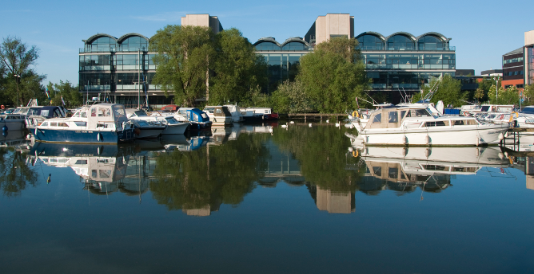
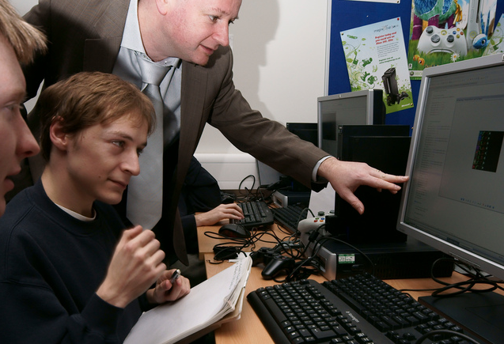
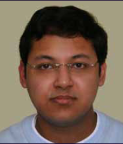
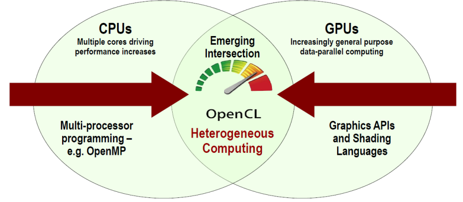
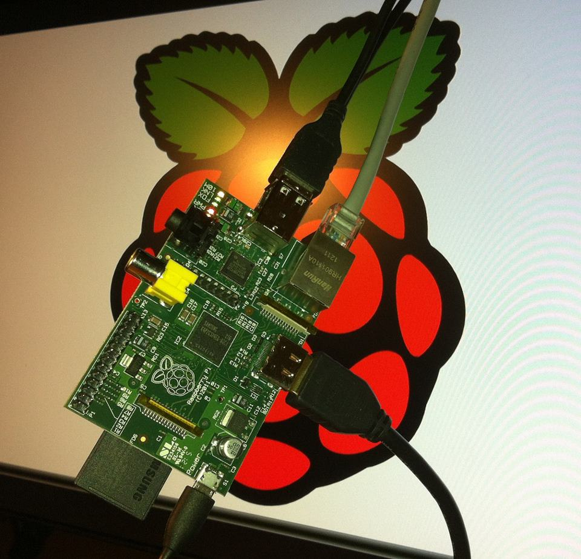

##**Games Computing at Lincoln**

###BSc(Hons) Games Computing
###MComp Games Computing

###Dr. John Shearer - programme leader

> "The University is fully committed to research-engaged study. The School of Computer Science has an excellent reputation for research, and students undertake their studies guided by research active staff."
  - Dr. David Cobham, Head of the School of Computer Science

##Welcome

- A very warm welcome from the School of Computer Science.

- Staff and students are on hand today to answer your questions.

> - James Munro
> - BSc(Hons) Games Computing
> - MSc by Research

##What is Games Computing?

- The study of games development and games design issues from a technical perspective.

- Emphasis on underpinning computer science fundamentals.

- Strong ethos of research and analytical thinking

##Student Profile
###Olivier Szymanezyk

> - BSc(Hons) Games Computing,
> - MSc Advanced Games Computing,
> - PhD research student.
>   - Olivier's crowd simulation research

##Why study Games Computing?

- Games Computing develops all core Computer Science skills
  - you could argue that studying to building Computer Games is an excellent way to learn Computer Science

###Why study Games Computing?

- Games Computing develops your understanding of games technologies:
	- Game engines
	- Graphics programming
	- Game design

###Games Programming

> - Masters students investigate games programming with a Playstation2 Linux Development Kit and Xbox360 consoles.

###Why study Games Computing?

- Games Computing includes contemporary industry trends, such as:
	- Serious games
	- Social games
	- Mobile technologies

###Why study Games Computing?

- Be equipped for a career in the games industry or in other related technology sectors

> - Maung Bo, 4th year MComp Games Computing, worked in partnership with Blueprint Games of Newark for his 3rd year project

###Programmes

####BSc

- Three years of progressive study, developing independent thinking and confidence to tackle complex problems

####MComp

- Four years of progressive study developing independent thinking, complex problem solving and Masters level achievement

###What will I study?

- lots of fun stuff!!
- generic Computer Science skills
- Games specific modules
- group work and professional practice
- optional modules

##First year

- Introductory Games Studies
- Game Design 1
- Programming and Data Structures
- Algorithms and Complexity
- Computer Architectures
- Maths for Computing
- Web Authoring

##Second Year

- Graphics
- Object-Oriented Programming
- Games Programming
- Human-Computer Interaction
- Artificial Intelligence
- Game Design 2
- Professional Practice
- Group Project
- Study Period Abroad [optional]

##Third Year - Required

- Project (Computer Science) [double module]
- Advanced Games Studies [double module]
- Game Engine Architectures
- Physics Simulation

##Third Year - Options

- Software Engineering [Optional]
- Parallel Computing [Optional]
- Mobile Computing [Optional]
- Entrepreneurship and Innovation [Optional]
- Entrepreneurship and Innovation 2 [Optional]
- Business Intelligence [Optional]
- Critical Perspectives on Project Management [Optional]
- Autonomous Mobile Robotics [Optional]
- Image Processing [Optional]

##Fourth Year (MComp) - Required

- Movement Interfaces
- Advanced Graphics
- MComp Research Project
- Software Engineering (M)

##Fourth Year (MComp) - Options

- Parallel Computing (M) [Optional]
- Entrepreneurship and Innovation 1 (M) [Optional]
- Business Intelligence (M) [Optional]
- Autonomous Mobile Robotics (M) [Optional]
- Critical Perspectives on Project Management (M) [Optional]
- Image Processing (M) [Optional]
- Data Analytics and Visualisation [Optional]

##Prospects and Placements

##Prospects and Placements

- 93.1% of our graduates are in employment 6 months after graduation (Sector average: 84%) (for the School)
- Games Computing graduates find employment in a wide range of destinations.
- Projects and recruitment links with Electronic Arts
- Further study and research degrees are available.
- Placements and internships are promoted and encouraged

##Placement / Internship

- Placement
  - 12 months between years 2 and 3
  - University Careers Service and School support in finding and applying
  - No tuition fee charged for the year out
- Internship
  - More flexible
  - Summer internships
  - Companies may be more willing to offer paid/unpaid internships

##Facilities

- Windows, Linux, MacOS workstations
  - i7 3.7GHz, 16GB RAM, NVidia GeForce GTX 750 Ti
- Unreal Development Kit software
- Unity Game Engine
- XBox360 Kinect camera systems
- Touch screen monitors
- Android/iOS mobile devices

##Graduate Spotlight

##Graduate Spotlight

- David Stenton graduated with BSc(Hons) Games Computing
- After an early career with UK-based games developer, Warthog, David joined Bioware and relocated to Canada
- He was recently a design team leader on the hugely successful Mass Effect 2 release
- David was awarded an Alumni Award at this years Graduation ceremonies

##Is it right for me ...?

- Games Computing is
  - Challenging
  - Rewarding
  - FUN!!

- Studying Games Computing requires
  - Enthusiasm
  - Commitment
  - Interest

##Is it right for me ...?

> - Lincoln Cathedral where each year hundreds of graduates receive their award from the Vice Chancellor in front of friends and family

##Computing Society

- Open to all students in the School
- Organises events, visiting speakers and socials
- GameJam 2012
  - 24 hour game 	development marathon!

- This year
  - GameJam2014
  - CanJam2014
  - The Seven Day	Game Challenge

##Questions???

- Thank you for your interest in the University, the School of Computer Science and our work!

- @UoLComputerSci
- @games_lincoln
- socs.blogs.lincoln.ac.uk
- www.facebook.com/lsocs

